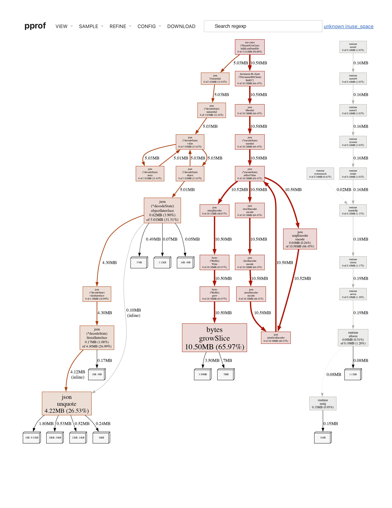
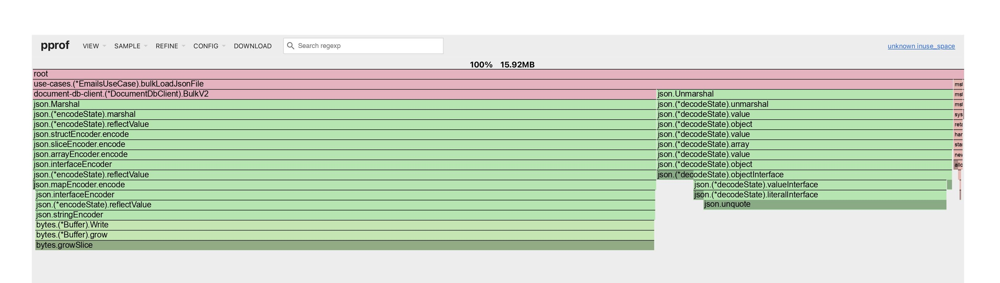
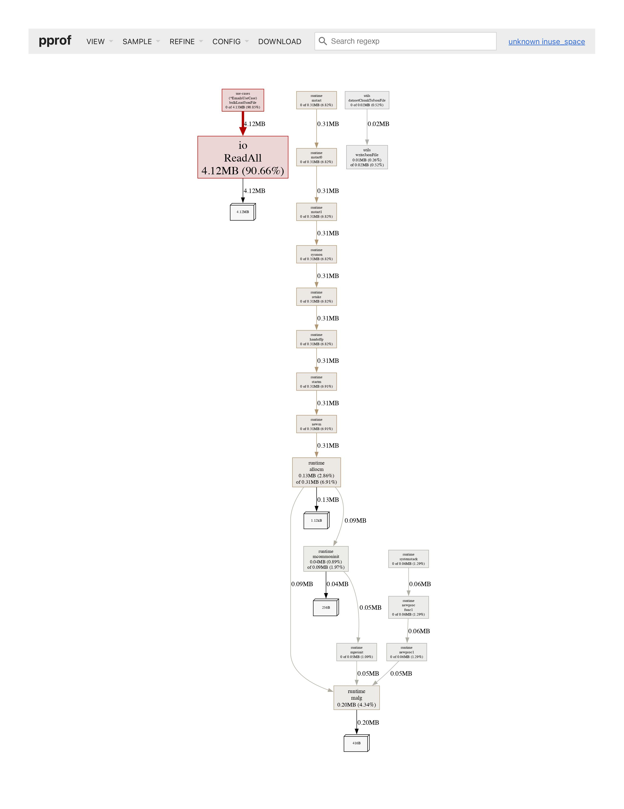
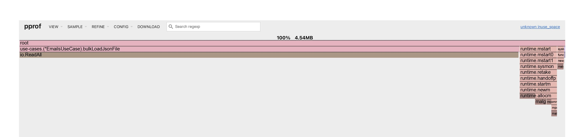

# Email Index 'n' Search

## Table of Contents

* Description
* Pre-requisites
* Quick Start
* Considerations
* Documentation

## Description

This project contains the source code for the project "email-index-n-search". A set of apps that allow indexing and searching emails persisted on ZincSearch, "a search engine that does full-text indexing".

## Pre-requisites

Before running the application, you need to have the following dependencies installed on your system:

* Docker: https://www.docker.com/
* Go (>= v1.21.1): https://go.dev/
* NodeJS (>= v18): https://nodejs.org
* ZincSearch (Docker Image): https://zincsearch-docs.zinc.dev/installation/ (no need to download, already configured in the docker-compose.yml file).

## Quick Start

### Initial setup

Follow the steps below to quickly set up the apps:

1. Clone the repository:

```bash
git clone https://github.com/juliandresbv/email-index-n-search
cd email-index-n-search/
```

2. On the root directory of the repository, run ZincSearch on Docker:

```bash
docker-compose up -d
```

or

```bash
docker compose up -d
```

3. Open three (3) terminal windows/tabs at the root of the project in each one:
    
    1. On tab/window #1, run the following commands to install the dependencies for the `indexer` app:

        ```bash
        cd indexer/
        go mod download -x
        ```

    2. On tab/window #2, run the following commands to install the dependencies for the `server` app:

        ```bash
        cd server/
        go mod download -x
        ```

    3. On tab/window #3, run the following commands to install the dependencies for the `emails-search-app` app:

        ```bash
        cd emails-search-app/
        npm install
        ```

4. Create and set the environment variables on a `.env` file for every app following the form of the `.env.example` file on each app's directory.

### Running the apps

Follow the steps below to quickly set up the apps:

1. Indexer:

    > Note: 
    > 
    > About the download and decompression of the dataset:
    >
    > The `indexer` app downloads and decompresses the dataset automatically. However, if you want to do it manually, you can do so by downloading the dataset from the following link: https://www.cs.cmu.edu/~./enron/enron_mail_20110402.tgz. Then, copy/move it to the `indexer/data` directory and decompress it.
    
    1. Open/re-use a terminal window/tab at the `indexer/` directory and follow the steps below:

        - Dev mode:

            ```bash
            make run-dev [prof.mode=<mode>]
            ```

        - Prod mode:

            ```bash
            make run-prd [prof.mode=<mode>]
            ```

        > Note: To run the app executing profiling analysis, add the `prof.mode=<mode>` flag to the command above. The available modes are: `cpu`, `mem`, `goroutine`, `thread`. The profiling results will be saved in the `indexer/profiling-results` directory.


2. Server:

    1. Open/re-use a terminal window/tab at the `indexer/` directory and follow the steps below:

        - Dev mode:

            ```bash
            make run-dev [prof.mode=<mode>]
            ```

        - Prod mode:

            ```bash
            make run-prd [prof.mode=<mode>]
            ```

3. Emails Search App:

    1. Open/re-use a terminal window/tab at the `emails-search-app/` directory and follow the steps below:

        1. Run app:

            ```bash
            npm run dev [-- --port=<port>]
            ```

        > Note: To run the app on a specific port, add the `--port=<port>` flag to the command above.

## Considerations

### Profiling

To interactively see the profiling results, run the following commands on a terminal at the `indexer/` directory:

```bash
go tool pprof -http=:<port> ./profiling-results/<.pprof-file>
```

Below are the graphics of some results of the memory profiling analysis:

- Pre-optimization memory profiling:

    - In-use space Callgraph:

        

    - In-use space Flame graph:

        

- Post-optimization memory profiling:

    - In-use space Callgraph:

        

    - In-use space Flame graph:

        

### Optimizations

#### Sequential vs Concurrent

At the initial stage of the development of the `indexer` app, the indexing process was developed with a [**sequential**](https://www.wikiwand.com/en/Sequential_algorithm) programming approach. However, after reviewing and assessing the resources consumed on the execution, it was found that tasks such as reading the dataset and parsing the data were taking a lot of resources and time while running.

Looking at the OS Activity Monitor, the memory consumed by the indexer with this approach was around 2 GB and it was increasing as time passed.

Therefore, another kind of approach should be implemented to improve the performance of the app.

After some research, it was found that the [**concurrent**](https://www.wikiwand.com/en/Concurrent_computing) programming approach could be a good option to improve the performance of the app. So, the indexing process was re-implemented using the concurrent programming approach.

The tasks that were re-factored to be executed concurrently were:

- Downloading the dataset:

    The download is split into concurrent go routines that will download the dataset in chunks of 5 MB.

- Reading and parsing the dataset, and producing JSON files to index:

    The reading and parsing of the dataset is split into chunks of 1000 files (this will be further explained in the JSON file size section) and uses a proportion of 25% of the amount of the chunks to process.
    
    For the specific dataset used in this project, the amount of files to read is around 517000 files, resulting in 517 chunks of size 1000, and 143 (the result of the 25% of 517 chunks) go routines spawned to process each chunk.

    The concurrent programming approach uses a [semaphore](https://www.wikiwand.com/en/Semaphore_(programming)) logic to control the amount of go routines spawned at the same time. This is done to avoid the overuse of resources and to limit the amount of concurrent go routines running.

    The final step of this set of tasks is to produce the JSON files to index. This is done by marshaling the data read and parsed from the dataset into JSON files.

- Indexing the documents via ZincSearch API using [bulk load endpoint](https://zincsearch-docs.zinc.dev/api/document/bulkv2/):

    Once the JSON files are produced, the indexing process is done by sending an HTTP request to the ZincSearch API using the bulk load endpoint with the data previously produced as JSON files.

    This process was also done using concurrent programming via go routines supported by a [semaphore](https://www.wikiwand.com/en/Semaphore_(programming)) logic.

    The proportion of go routines spawned to bulk load the JSON files concurrently is 5% of the amount of JSON files produced. This percentage was tuned to avoid overloading the ZincSearch API.

    Additionally, a [throttling](https://www.wikiwand.com/en/Rate_limiting) logic was also implemented to send HTTP requests every 750 milliseconds.

#### JSON file size

For indexing the emails to ZincSearch, a bulk load technique was considered the best option to go with, since the ZincSearch API provides two endpoints to bulk load documents.

The specification of the bulk load V2 endpoint can be found [here](https://zincsearch-docs.zinc.dev/api/document/bulkv2/).

At the first stage of the development, the size of the JSON files was 5000 records per file. However, after some testing, it was found that the size of the JSON files was too big and the indexing process was taking a lot of time to complete and was producing low latencies while consuming the API. The internal response time of the API was around 20000 milliseconds.

Therefore, the size of the JSON files was reduced to 1000 records per file. This change improved the performance of the indexing process and the latencies while consuming the API. After this change, the internal response time of the API was around 200 milliseconds.

As a remark, the trade-off between the size of the JSON files vs. the response time and throughput to the API was a key consideration in deciding the size of the JSON files. A smaller size of records for every JSON file will produce more files at the end, but it will result in better performance while consuming the API. So consuming more storage space is preferable to overloading ZincSearch API.

#### DTOs (Marshaling and Unmarshaling) vs Bytes

Before the optimizations were applied to the bulk load process. The profiling results showed that the use of Marshal and Unmarshal functions was pretty much recurrent. This specifically happened when reading each JSON file and converting it to a struct to be indexed via ZincSearch API. The Pre-optimizations memory profiling/In-use space Callgraph graph above helps to understand this. The implication of using Marshal and Unmarshal was that on the runtime there were a lot of allocations and deallocations of memory. In the long run, this could produce memory leaks, which could deteriorate the performance of the app.

Therefore, the use of Marshal and Unmarshal functions was replaced by the use of bytes. This change improved the performance of the app and reduced the memory usage. The Post-optimizations memory profiling/In-use space Callgraph graph above helps to understand this.

The trade-off of this change is that the code is less readable, since in a practical sense, it loses context because of replacing DTOs (whose purpose is to provide a clear contract/interface of the shape of the data that is going to be expected on each point of the app) for bytes. However, the performance of the app is more important than the readability and maintainability of the code.

## Documentation

### API documentation

For a better understanding of the Server API, the documentation of the endpoints is available on the following link `http://localhost:<port>/docs/index.html` while the `server` is running.
